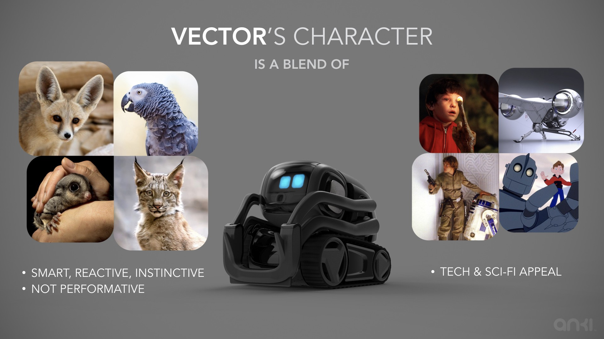
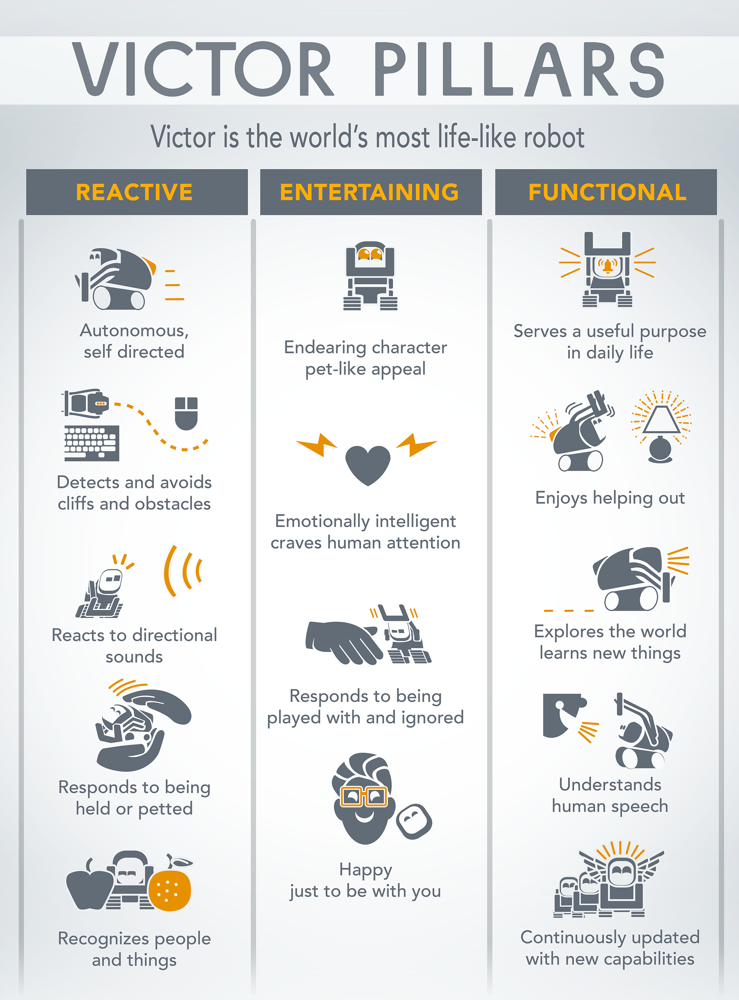

# Vector Character Design

Adapted from Cozmo's "Brief" (see the [Cozmo design guide](Cozmo design guide.md) ):

The ultimate goal for Cozmo
and Vector is to create a real, believable robotic character that feels alive.

Something we have seen over and over again in movies, but  never in real
life. Cozmo and Vector need to feel alive the same way a pet feels alive, by
creating a strong emotional connection with people. Really long term, we want
to create a series of characters, with an ecosystem around them and the ability
to have the types of stories we only see in movies play out in the real world.

The top priority, above
all else, is highlighting the personality of the character.  Everything else
becomes a tool in service of that goal.

Cozmo and Vector are the soul of the product, and where the ‘magic’ is.
Everything else in the experience is in service of making the character feel
alive, and emotionally intelligent.  Mini-games, UX, game mechanics/structure,
story, etc. should all be thought of as tools for creating context for making
Cozmo and Vector feel more alive with a richer personality. The game is a means
for driving engagement / exploration of Cozmo and Vector, and their boundaries.
Cozmo and Vector will have a limited ability to understand his world in general,
but be extremely smart in specific areas. Our goal is to optimize for his
strengths, and avoid his constraints. The goal for any accessories, games, etc.
for Cozmo and Vector is to channel players’ attention towards the things that
Cozmo and Vector understand really well. These are the best opportunities for
us to impress and surprise the user with emotions and depth of character and
intelligence in a way that only we can.

Think of Cozmo and Vector as your robot pets, with regards to exploring
possible interaction, play and responsibilities.  Not in how it looks (no fur
and whiskers). He’s smart, he’s emotional, he recognizes you, he has a sense of
humor, he wants to interact with you -- these are the types of feelings we want
to naturally draw out of users.

Vector's character:

*Figure: Vector's character*

A "placement" -- or pillars -- of Vector character and experience:

*Figure: Vector Pillars*

Some new things like a petting:

> "In the early stage of production, we worked on a petting system that allows
> Vector to feel a finger touch on his backpack. We looked at different animals
> like dogs and cats for reference, but couldn’t find anything useful; the
> reactions didn’t feel like Vector. Eventually one of the animators found a
> video of a wild owl and the cameraman gently fondled his back a very sweet
> way and we ended up using it as a reference for Vector’s reactions to petting."

As well as some refinements or things that he can do a bit better than Cozmo:

*Figure: Finger pouncing updates*

##  Eyes
Anki used the following resources to construct Vector's and Cozmo's eyes,
according to lead animator Mooly Segal:

* Jason Osipa, _"Stop Staring: Facial Modeling and Animation Done Right"_
  3rd Edition, 2010.   This "is a wonderful book on rigging eyes for 3D
  animation.. that focuses on setting up eye and face controllers."

* "Keith Lango also had a series of articles on eye movement called
  _The Eyes Have It_ and he had a great selection of research material and
  examples from lab experiments, animated films and live action videos about
  how the eyes work and acting through eyes."

I couldn’t find the series he is referring to (although there are many academic
publications with the name _The Eyes Have It_.  This is the only similar blog
that I can find by Keith Lango:

> Saccadic Eye Movement "using well timed shifting of the eyes.  The shift
> could be motivated by the internal thoughts or feelings of the character
> while they are presented with a moment of quietness or thought.  There the
> relative pace of the shfts gives indication to the speed of the unfolding of
> thoughts in the head or the emotional energy of the moment.  If the darts are
> fast paced and come quickly one after the other it can indicate a great
> flurry of thought or a rapid firing of emotional energy.  Slower pace
> indicates a more methodical, more pondering state of mind."
>
> http://keithlango.blogspot.com/2005/12/saccadic-eye-movement.html

## References

Mooly quoted in:

_How Anki designed and animated a loveable personality for its real robot friend, Vector_,
Neil Bennett, Digital Arts Online, 2018 December 19
