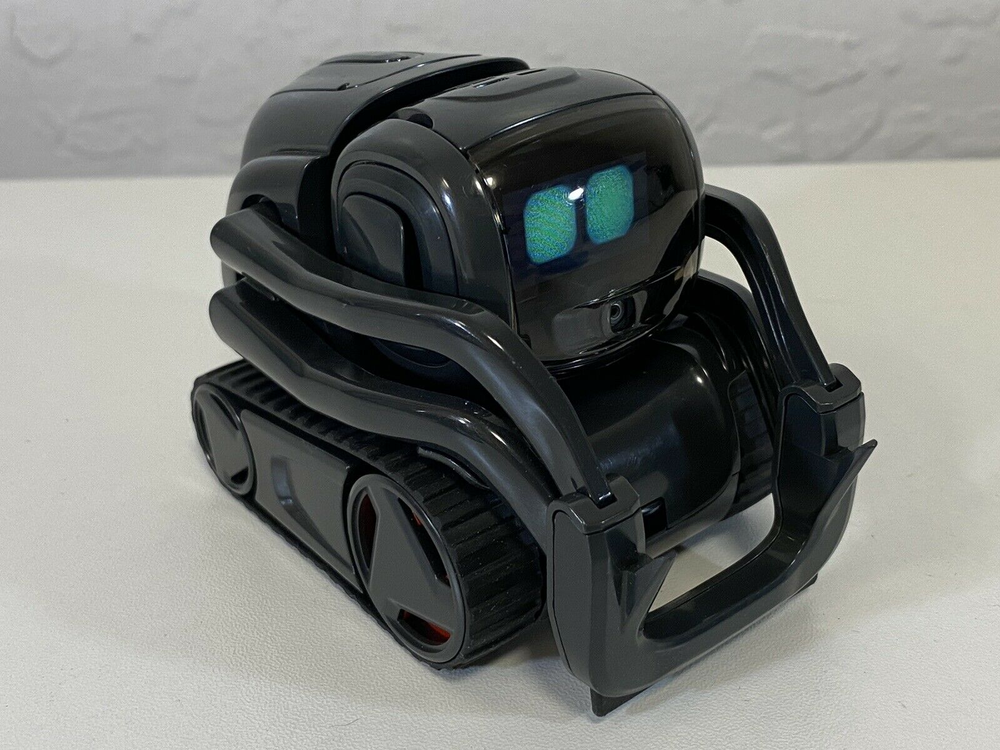

# Victor DVT2

"Victor DVT2" prototypes are the second of the Design Validation Test batches for Vector.

These are similar to DVT1, with a few differences:

* Victor DVT2s run Embedded Linux and not Android like DVT1.
* Their body boards have a few small electrical differences, and are more compatible with modern firmware.
* Many of these run the same exact build (labelled "0.10.0d"). It is speculated that a few of these were animation bots.
* All we have seen so far run the same exact kernel.
* It is possible to put modern firmware in there but some things will be broken due to the old body board. It also requires many workarounds.

Similarities to Victor DVT1:

* Their serial numbers are strings such as "1f19f8b7".
* The "head board" hardware is pretty much exactly the same, but the "body board" hardware is very different compared to modern Vector hardware. This locks them to old DFU and they are not viable for normal Vector body replacements.
* There are some positives if you are a passionate developer. They have ADB open which means you can solder on USB and mess around all you want. Everything is completely open and unlocked so you could have a fun time. There is no (useful) recovery or system_b partition so be careful.
* Most have SSH open, but there is a root password. ADB over TCP is fully open but it may require a couple reboots.
* Most of them have old BLE software, and it is hard to connect them to your own Wi-Fi.

Their shells (+ motor boards, backpack board, laser) are fully compatible with regular Vector circutry.

Their heads come with a strange partition table, but it can be upgraded through QDL to be able to run custom firmware. Check the Qualcomm Download Mode section.

Their ABOOTs are compatible with DVT1/3, and support boot slots. Their aboots can be used in a newer partition table, and allow for unsigned kernels. None of the CPU fuses are set, so you can run whatever you want.

Some of these connect to a network with the credentials below, which can be faked on your own router or hotspot so you can use ADB over TCP:

SSID: `AnkiRobits`
Password: `KlaatuBaradaNikto!`

These turn up from time to time on Ebay.

