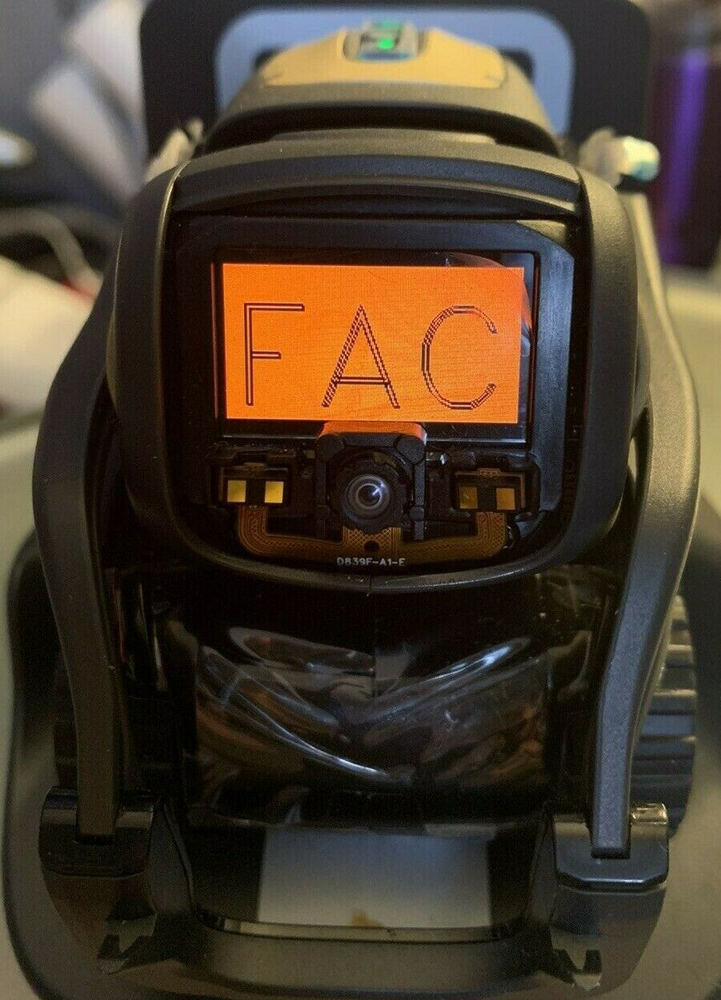

# Whiskey

The “Whiskey” prototypes were built from modified Vector hardware. The key
change(s) are:

* The time of flight sensor was removed from the body-board
* Two time of flight sensors were placed on the head, on either side of the LCD
* The body-board layout was rearranged to better dissipate heat away from the battery.
* They are labelled as "HW: 7" instead of a normal Vector's "HW: 6". The software can detect this and it makes an extra CCIS menu for the extra sensors.

By placing the time of flight sensors in the head, Whiskey could scan around more — moving the head up and down, as well as using a more sophisticated version of the time of flight sensor.  This would allow him to map the edges far better, as well as scan for objects and interesting things like hands and faces.

In some reports the idea was to use the changes to the TOF sensor placement for a next generation Cozmo design.  The project was cancelled before Anki’s demise.

In the current form, Whiskeys have a few software quirks. Regular dev bots have both the dev ABOOT key and anki.dev in command line, but many Whiskeys only have the dev ABOOT key and no anki.dev in command line. This means they are restricted to running custom firmware. Some, however, have been unlocked to be full dev bots but not many of those have shown up. Another quirk is that all of them are in FAC mode. They all have dev recoveries, so this is easily bypassable.

These turn up from time to time on Ebay.

