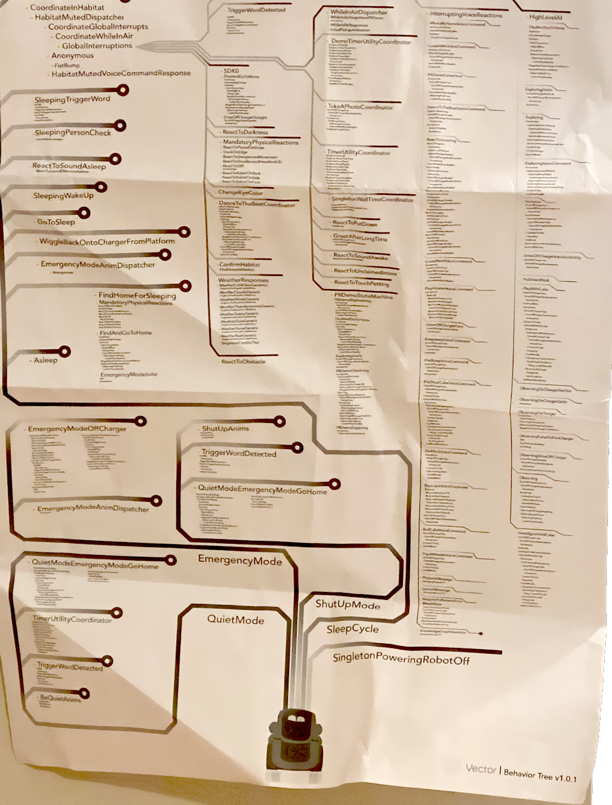

*Figure: Vector Behavior Tree v1.0.1*

Note: all of the behavior related files are in the following directory, and
sub-directories:

     /anki/data/assets/cozmo_resources/config/engine/behaviorComponent

*Habitat:* I am not sure if this term refers to the desk / table in general,
or is specifc to the Vector Field (tray).

These are not referred to by the rest of the behavior tree, but the names are in 
`libcozmo_engine`.  I am not sure if these are unused, or invoked internally by the C++.
If they are, the C++ should be refactored to use the behavior tree.

## Self-maintenance behaviors
Self-maintenance behaviors:

- [Startup](startup behavior.md) related to Vector turning on and settig up the
  behavior tree.
- [Power management](power management.md) related to turning on and off,
  initiating return to charger when the battery is low, as well as
  self-protection behaviors like very low battery, and over temperature.
- [Reacting to environmental conditions](mandatoryPhysicalReactions.md) while driving around
- Drive home
- [Communication trouble behaviors](communication trouble.md) are invoked when
  Vector can't connect to a Wifi SSID or can't reach the voice server.
- [Quiet mode](quiet mode.md) related to Vector being quiet -- not interacting
  with a person or toy, but also not asleep.
- Sleep

## Social behaviors

- Petting
- Being held
- Playing
- Helping out
    * Question-Answer
    * Timer
    * Weather

## Toys and Accessories

## Change history synopsis

|Date|Change|
|----|------|
|2020-12-1|Created|

